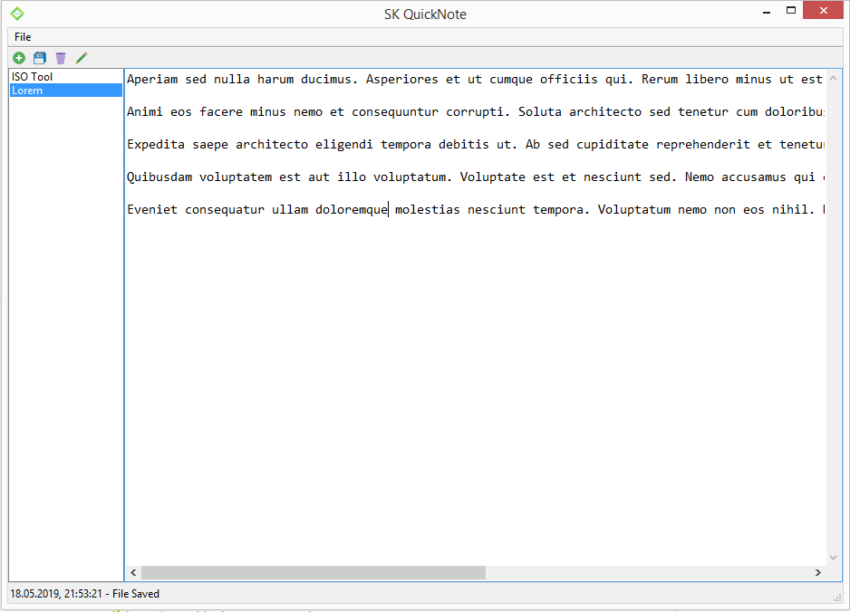

# SK-Quicknote
A simple notepad written in Pascal. 

Compatible with all Lazarus supported platforms (as of 2019) as well as compatibility with older Systems from Windows 95 onwards.

## Why?
I am (was) an avid user of the default windows notepad for taking quick notes in meetings and for quick pastes during develing Software. This works fine until you need to shutdown your PC after a busy day. This is the moment when all those open windows need to be closed - and for every open (and not yet saved) notepad file, a new filename and a location where to save it has to be entered.

I try to solve this hassle by having the text files all located in one folder (so they can be synced e.g. using OneDrive) and providing a simple and minimalistic interface to quickly switch between notes. Most importantly, there will be no more "blocking" dialogs asking you for a location. When creating a new file, enter a "Note Name" and you are done. When shutting down no alerts will popup (by design) and unsaved work will be lost.

I think I solved these problems for me and use it daily. It is a VERY simple and "prototype" application, so be aware - it may not be for everyone. I am well aware that there are other more mature solutions out there. 

## Features
The following features are available with the initial release:
* Simple Access File List
* Tray Icon menu commands for quick access if window is not in focus.
* Basic "Note Taking" Functionality
  * Add new notes
  * Edit notes and save them
  * Edit note title
  * HotKey support

## Download

Head over to the [releases](https://github.com/bastisk/SK-Quicknote/releases) page to get the latest version.

